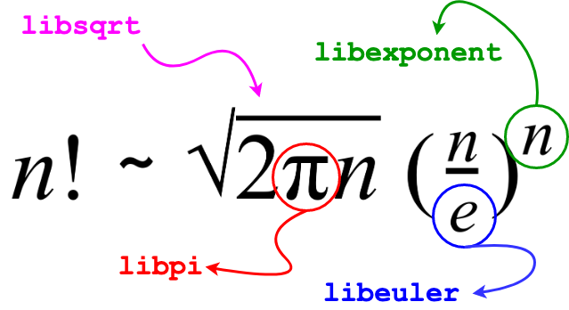
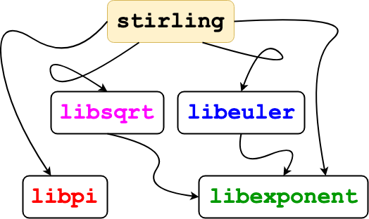

# What is Math in Jenkins?

Math in Jenkins is a prototype for a multi-module `C++` project that needs to adopt Continuous Integration/Continuous Deployment pipelines. The project is an implementation of [Stirling formula](https://en.wikipedia.org/wiki/Stirling%27s_approximation) for calculating factorials. However, the implementation has one constraint: **no use of math libraries**. Therefore, the different components of the formula have to be implemented from scratch; mostly using approximation formulas and trying to improve the precision over the lifetime of the modules. 

## Why Stirling Formula?
The aim of this prototype is not to dive into math or argue about the best mathematical solutions out there. However, the formula, as presented above, shows many plausible characterstics that we can use to design a CI/CD pipeline:

* It is a real formula that actually does somethine useful: calculates an approximate value for factorials of large numbers.
* The modules used in this impementation are approximations, and not perfect implementations. Therefore, we can observe the cascading effects of losing precision over the chain of the computation.
* It shows how upstream module implementations affects downstream results. This will show us the importance of automated testing.
* Some modules are actually dependent on other modules as presented in the *dependency graph* below.
* Although simple and straightforward, it reflects many real-world projects that have dependencies in independent git repositories.

### Modules

* [libexponent](https://github.com/mathinjenkins/libexponent): calculates exponents using basic arithmetic.
* [libeuler](https://github.com/mathinjenkins/libeuler): calculates an approximate value of "e", the base of the natural logarithm.
* [libsqrt](https://github.com/mathinjenkins/libsqrt): calculates an approximate value for the square root of a non-negative real number.
* [libpi](https://github.com/mathinjenkins/libpi): calculates an approximate value of PI.
* [stirling](https://github.com/mathinjenkins/stirling): uses the above libraries to build an executable that takes `n` as input and calculates `~n!`.

### Dependency Graph

## CI/CD
We assume that each library has a different owner and is developed independently. Therefore, libraries reside in their own repositories. Each library adopts a CI/CD pipeline where:

- Development effort is merged to branch `develop`.
- To test the effect of the new library contributions on **stirling** implementation, a `merge` from `develop` to `stirling` branch is executed.
- If the pipeline on branch `stirling` builds and passes the tests successfully:
    - A merge to `master` on the library is automatically executed.
    - The relevant `git submodule` in `stirling` repository is automatically updated.

### Tool
We use [Jenkins](https://jenkins.io/). A current deployment is available at [https://jenkins.abdelrahmanhosny.me](https://jenkins.abdelrahmanhosny.me) used for illustration purposes only and not guaranteed to stay for long time.

### Developer Guides
- **NO** direct commit to any `master` branch.
- **NO** direct commit to `stirling` branch. It has to be merged from `develop` branch.
- **NO** direct contributions to *stirling* repository, except for the main maintainer who defines the overall architecture of the repository and the unified build process.
- *Stirling* repository should always be locally buildable from its `master` branch using the instructions in its README.

## Contribution
This is a Work-in-Progress. Once in a mature state, we will add the contribution guide.

## License
[MIT License](https://github.com/mathinjenkins/README/blob/master/LICENSE)